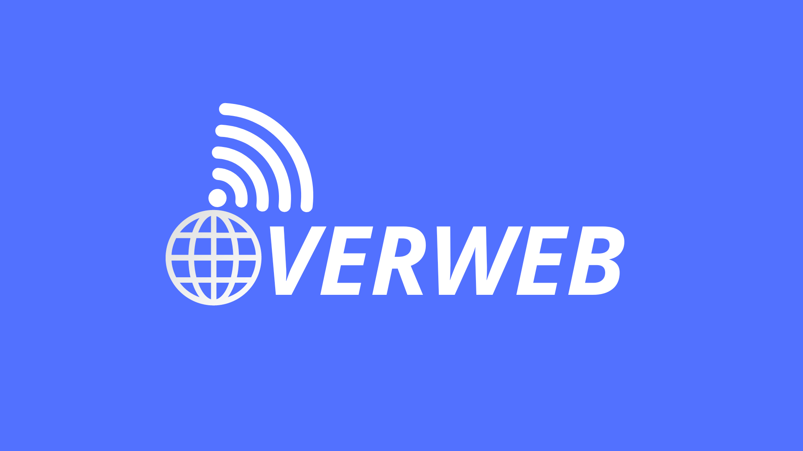

<h1 align="center">
  OverWeb
</h1>

  
  
  
  
  

  
  
  

  

# Projeto

Este é um projeto desenvolvido para a disciplina de Web 1, utilizando o framework Django para Python. O objetivo do projeto é criar uma aplicação web funcional e responsiva.

### Características

- **Autenticação de Usuários**: O sistema permite o registro e autenticação de usuários.
- **CRUD de Dados**: Os usuários autenticados podem criar, ler, atualizar e deletar dados.
- **Interface Responsiva**: A interface do usuário é projetada para ser responsiva e fácil de usar em vários dispositivos.

### Tecnologias Utilizadas

- **Django**: Django é um framework de alto nível para Python que incentiva o desenvolvimento rápido e o design limpo e pragmático.
- **SQLite3**: SQLite3 é um sistema de gerenciamento de banco de dados SQL embutido sem servidor.
- **Postgres**: Postgres é um sistema de gerenciamento de banco de dados SQL de objeto-relacional.

### Como Executar

1. Clone o repositório
2. Instale as dependências com `pip install -r requirements.txt`
3. Execute as migrações com `python manage.py migrate`
4. Inicie o servidor com `python manage.py runserver`
